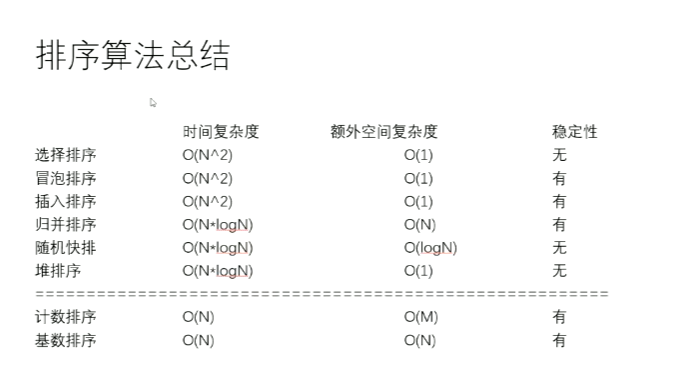

# 基础课


### 算法指标

算法优劣核心指标：

- 时间复杂度（流程决定）
- 额外空间复杂度（流程决定）
- 常数项时间（实现细节决定）


常数项时间操作：如果一个操作的执行时间不以具体样本量为转移，每次执行时间都是固定时间，这样的操作称为常数时间的操作。

常见的常数时间操作：

- 常见的算术运算：+、-、*、/、%等
- 常见的位运算：>>、>>>、<<、|、&、^等
- 赋值，比较，自增，自减操作等
- 数组寻址操作


算法时间复杂度：

1. 按照算法流程处理的数据的最差情况，把整个算法流程拆分为一个个基本动作，保证每个动作都是常数时间操作。
2. 如果数据量为N，看看基本动作的数量（即常数时间操作的数量）和N的关系，列出表达式。
3. 低阶项和高阶项的系数去掉，只把表达式的最高级项留下，记作O(忽略掉系数的高阶项)。


额外空间复杂度：

除掉输入参数，输出结果，算法运行所需要的空间。

如果算法流程所开辟的是有限个变量，与输入参数规模无关，额外空间复杂度就是O(1)


常见时间复杂度由低到高：

- O(1)
- O(logN)
- O(N)
- O(NlogN)
- O(N^2^)，O(N^3^)，O(N^4^)，......（线性时间）
- O(2^N^)，O(3^N^)，O(4^N^)，......（递归展开）
- O(N!)（全排列）


### 对数器


### 二分法


### 异或运算

异或运算：相同为0，不同为1

```
/*
          异或运算的性质
          假设N为任意实数
          性质1：0 ^ N = N
          性质2：N ^ N = 0
          性质3：异或运算满足交换律与结合律
          重点：我们可以将异或运算理解为二进制的无进位相加！也就是说，当两个数异或的时候，如果某一位同为1，则该位为0并且不向前进位。
         */
```

同或运算：相同为1，不同为0


移位操作

```
            /*
            mid = (left + right) / 2
            mid = left + (right -left) / 2
            mid = left + ((right - left)>>1)
            除以二就相当于N>>1，乘以2相当于N<<1，乘以2加1相当于  (N<<1)|1
             */
```


```
        /*
        给定int类型的数，提取出最右侧的1，即32bit上除了该位置为1其他全部变为0
        xor & (~xor + 1)
         */
```


```
    /*
    奇数与1异或相当于减1，偶数与1异或相当于加1。
     */
```


### 递归


### 排序算法总结

